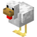
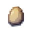

import Tabs from '@theme/Tabs';
import TabItem from '@theme/TabItem';
import { AwesomeButton } from 'react-awesome-button';
import AwesomeButtonStyles from 'react-awesome-button/src/styles/styles.scss?inline';

:::note

这个页面正在搭建，相关的链接可能无效。请谅解

:::

## 准备
如果你没有使用过MCJE或者对电脑知之甚少，为了保证你的体验，我们建议你参考一下下面的配置

| 硬件 | 要求 |
| --- | --- | 
| CPU | ≥4GHz |
| RAM | ≥8GiB（可用内存≥4GiB） |
| Disk | 实际读写速度≥200MiB/s（这一项没太大影响，只是游戏启动时会慢一点）/≥2GiB可用空间 |
| Screen | 不会抽烟[^1]的屏幕 |

## 下载

:::danger

请再次确认您认真阅读了我们的文档且了解一定程度的MCJE知识后再下载运行MFC，这样一些小问题足以自己解决。对于操作不当所造成的问题我们并不会帮您处理

:::

我们提供的客户端是和服务器同步开发的，能最大程度保证玩家体验

---

- MFC.sdandard

一般用户（比如游戏玩家）十分推荐使用MFC.sdandard，其包含了所有必要的mod与其他优化修改，体验最好。

请确保您至少有2GiB存储空间再下载运行MFC.sdandard

mod列表及其他依赖详见压缩包`./.minecraft/version.txt`或客户端内点击`more info.`按钮

<Tabs>
  <TabItem value="huahuo" label="花火盘（OD）" default>
    <AwesomeButton cssModule={AwesomeButtonStyles} type="secondary" style={{textDecoration: 'none'}}
      href="https://pan.ovome.icu/f/LYvUe/MFC-0.0.3d-fix2.7z">
      下载（可并发）
    </AwesomeButton>
  </TabItem>
  <TabItem value="local" label="restdrive（福建）">
    <AwesomeButton cssModule={AwesomeButtonStyles} type="disabled" style={{textDecoration: 'none'}}
      href="">
      暂无
    </AwesomeButton>
  </TabItem>
  <TabItem value="mediafire" label="mediafire（US）">
    <AwesomeButton cssModule={AwesomeButtonStyles} type="disabled" style={{textDecoration: 'none'}}
      href="">
      暂无
    </AwesomeButton>
  </TabItem>
</Tabs>

---

- MFC.core

对于开发者一类特殊用户，我们提供一个最小化的整合包，除必要的mod外不外加任何修改，可以按需调整（但注意，不要[作弊](/docs/rules/cheat)）

除非作错误演示，否则不要删除MFC.core包中的任何mod

<Tabs>
  <TabItem value="huahuo" label="花火盘（OD）" default>
    <AwesomeButton cssModule={AwesomeButtonStyles} type="disabled" style={{textDecoration: 'none'}}
      href="">
      暂无
    </AwesomeButton>
  </TabItem>
  <TabItem value="local" label="restdrive（福建）">
    <AwesomeButton cssModule={AwesomeButtonStyles} type="disabled" style={{textDecoration: 'none'}}
      href="">
      暂无
    </AwesomeButton>
  </TabItem>
  <TabItem value="mediafire" label="mediafire（US）">
    <AwesomeButton cssModule={AwesomeButtonStyles} type="disabled" style={{textDecoration: 'none'}}
      href="">
      暂无
    </AwesomeButton>
  </TabItem>
</Tabs>

[^1]:MSMP主要开发者之一`sfg`的屏幕曾经在他PVP时开始吸烟，最后连天花板都模糊不清。不知道他后来如何让那块屏幕戒烟的