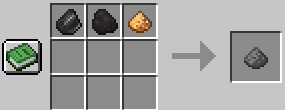
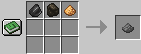
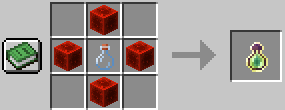
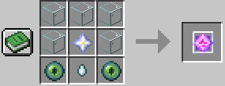

:::caution

目前该世界规则及玩法仍在不断制作和完善，可能存在一些问题，请及时[反馈](../feedback)

:::

- 地图为1:1000还原的地球（在这里，地球是平的且边缘是虚空，可以看看[我们的实时地图](map.mspx.tk)）
- 难度普通
- 地狱有边界，边界内面积为1322500格
- 玩家无法通过锻造台制作任何下界合金盔甲（仍然允许制作下界合金武器和工具）
- 保留物品栏开启，死亡时不会丢失物品或经验，但如果被玩家杀死，将被夺走2点生命上限，最低剩余6点，最高达到40点

## 新增的合成配方

两种火药制作成功率均为75%

### 被修改的原版合成配方

原版水晶配方不再可用